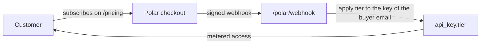

# POLAR.md — subscription integration architecture

How Confinia integrates [Polar](https://polar.sh) as a merchant of record to
turn a subscription into API access, automatically. This documents the
**integration**; the subscription journey is tested in
[TEST_POLAR.md](TEST_POLAR.md).

## Merchant of record

Polar is the **legal seller** to the customer: it takes the payment, charges EU
VAT, issues the invoice, and handles refunds and failed-payment retries. The API
never sees card data. Our only responsibility is to react to Polar's events and
grant the right level of access.

## The provisioning loop



1. **Checkout** happens on Polar (`buy.polar.sh` links on `/pricing` and the
   `/account` page), prefilled with the signed-in email so the match is exact.
2. **Webhook** `POST /polar/webhook` receives subscription events. Signatures are
   verified with the **Standard Webhooks** scheme (HMAC-SHA256 of
   `id.timestamp.body`, base64 secret); anything unsigned or tampered is
   rejected with `401`.
3. **Provisioning** upserts the subscription state and applies the buyer's best
   active tier to every API key of that email. A key created **before or after**
   the purchase both end up on the paid tier; a cancellation drops the email back
   to `free` on the next event. No human in the loop.

## Accounts: sandbox and production

Polar has two fully separate environments. Set up **sandbox first**, validate the
whole loop end to end, then repeat the exact same steps in production. Nothing
crosses over: separate organizations, separate tokens, separate product and
webhook ids.

| | Sandbox | Production |
|---|---|---|
| Dashboard | `https://sandbox.polar.sh` | `https://polar.sh` |
| API base | `https://sandbox-api.polar.sh` | `https://api.polar.sh` |
| Test cards | Stripe test cards work | real cards only |

In each environment: create an organization, then an **Organization Access
Token** (Settings → Developers) with scopes `products:read`, `products:write`,
`webhooks:read`, `webhooks:write`, `checkout_links:write`. The token is the
`polar_oat_…` value used below; it is environment-specific.

Two dashboard-only steps stay manual (they gate real money, not the integration):
activating the organization so it can charge live cards, and connecting the
payout account (identity + IBAN) to withdraw funds.

## Semi-automated provisioning

[`deploy/polar/setup-polar.sh`](deploy/polar/setup-polar.sh) provisions the two
products and the webhook endpoint from the token, idempotent-ish (products
matched by name, webhook by URL). Run it against sandbox first, then prod:

```sh
POLAR_ENV=sandbox POLAR_TOKEN=polar_oat_xxx ./deploy/polar/setup-polar.sh
POLAR_ENV=prod    POLAR_TOKEN=polar_oat_yyy \
    WEBHOOK_URL=https://api.confinia.io/polar/webhook ./deploy/polar/setup-polar.sh
```

It prints the ids and webhook secret to paste into `deploy/secrets.env`. The
token is read from the environment and never written to disk.

## Configuration

Runtime values live in `deploy/secrets.env` (never committed):

| Variable | Purpose |
|---|---|
| `POLAR_WEBHOOK_SECRET` | verify the webhook signature |
| `POLAR_PRODUCT_PRO` / `POLAR_PRODUCT_ENTERPRISE` | map a Polar product id to a tier |
| `POLAR_ACCESS_TOKEN` | provisioning token (setup script; not needed at runtime) |

The webhook endpoint points at `https://api.confinia.io/polar/webhook` in
production (and at your API's public URL in sandbox).

## Tiers and metering

Access is metered by **reports** (premium artifacts: area-change reports,
downloadable commune records, bulk exports). Basic lookups (a unit at a date, a
unit's history) are not reports and stay free under fair use.

| Tier | Reports | Notes |
|---|---|---|
| Free | a lifetime trial allowance | basic features |
| Pro | a monthly allowance | professional features |
| Enterprise | unlimited | adds one-shot bulk exports and team features |

Past the allowance the API answers `402` with a pointer to `/pricing`. Some
capabilities are tier-locked (for example the one-shot bulk export
`/v1/export/ohm?bulk=true` requires Enterprise), returning `403` otherwise.

## Tests

The full subscription journey (signature rejection, purchase upgrades existing
and future keys, allowance and 402, cancellation demotes) runs in CI on every
push and is documented in [TEST_POLAR.md](TEST_POLAR.md). Post-deployment checks
live in `tests/smoke_prod.py`.
