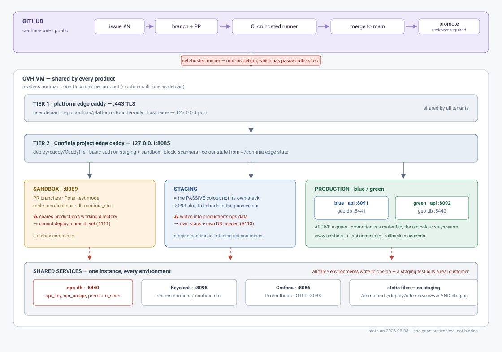

# STACK_confinia.md — how Confinia is deployed on the shared VM

> Instance of [`STACK_template.md`](STACK_template.md). **Same section headers**, so
> this file and any other `STACK_<product>.md` can be diffed side by side.
>
> It answers one question: **where does a request go, and who owns what.**
>
> ⚠️ The template describes the **target**. This file describes **what actually
> runs on 2026-08-03**. Where the two differ, the difference is written down here
> rather than smoothed over — §14 and §15 are the honest part of the document,
> and they are the reason it is worth reading.



---

## 0. Per-product facts

| Field | This product |
|---|---|
| Product | `confinia` |
| Unix user | **`confinia`**, no sudo — migrated 2026-08-11, ~23 min downtime ([MOVE.md](MOVE.md), issue #99) |
| Repo | `confinia/confinia-core` (**public**) |
| Port band | `80xx` |
| Apex hostname | `www.confinia.io` (`confinia.io` 301-redirects to it) |
| Project edge router port | `127.0.0.1:8085` |
| Sandbox entry port | `127.0.0.1:8089` |
| Staging stack port | none — staging *is* the passive colour. The old `8093` slot was removed on 2026-08-11: that port is BURNED (see §4) |
| Isolation unit | one rootless podman user, **its own** since 2026-08-11 |

**Public hostnames → local port** (registered in the platform edge, §4):

| Hostname | → local port | Environment |
|---|---|---|
| `confinia.io` | — | 301 → `www.confinia.io` |
| `www.confinia.io` | `127.0.0.1:8085` | production (active colour) |
| `api.confinia.io` | `127.0.0.1:8085` | production API |
| `staging.confinia.io` | `127.0.0.1:8085` | staging (passive colour) |
| `staging.api.confinia.io` | `127.0.0.1:8085` | staging API |
| `sandbox.confinia.io` | `127.0.0.1:8085` | sandbox |
| `time-slider.confinia.io` | `127.0.0.1:8085` | demo |

Note the difference from the template: **every Confinia hostname enters on the
same port 8085**, and the Tier-2 router splits them by `Host`. The template
assumes Tier 1 routes each environment to a different port. Confinia's way keeps
the platform edge simpler and means adding an environment needs no founder
action; the cost is that all environment routing is in one Caddyfile, and a
mistake there is a production mistake.

---

## 1. TL;DR

- **One VM, one Unix user per product** — *not yet true here*: Confinia runs as
  `debian`, the sudo-capable admin account (§3).
- **One compose stack per environment**, own port band, own database, own realm —
  *partly true*: the geo databases are per colour, but **one ops database is
  shared by production, staging and sandbox** (§14).
- **Blue/green only inside production**: two colours, one live, one warm. Promotion
  is a routing flip, not a rebuild. Rollback takes seconds.
- **The edge decides nothing but routing.** Tier 1 is founder-only, changed by PR
  to `confinia/platform`, never on the VM.
- **GitHub drives everything**: issue → branch → draft PR → tests → merge →
  staging → *human approval* → production. Done means **promoted and verified**,
  not merged.

---

## 2. Layers — who owns what

| Layer | Owns | Rule |
|---|---|---|
| **Platform edge** (`platform_caddy_1`, repo `confinia/platform`) | `:443`, certificates, hostname → port | **Founder-only.** Describe the change needed; never apply it. Never hand-edit on the VM — a platform redeploy reverts it. (RULES 8) |
| **Project edge router** (`confinia_caddy_1`) | host-based blue/green routing, basic auth on staging/sandbox, `block_scanners`, `/auth`, `/grafana` | Lives in this repo at `deploy/caddy/`. Reloaded gracefully on promote. |
| **Per-stack caddy** | — | **Not used.** The Tier-2 router talks to the API containers directly on their loopback ports. One layer fewer than the template. |
| **Compose stacks** | `confinia-blue`, `confinia-green` (api + geo db each) and the shared-services project | Colour stacks are stateless plus a disposable geo DB. Precious state lives in shared services. |
| **Unix user** | podman storage, volumes, `deploy/*.env` | `ssh debian` — which is also the admin account (§3). |

---

## 3. VM users (rootless podman)

| User | Role |
|---|---|
| **`debian`** | Admin: platform edge (Tier 1), all `sudo`/root ops, `confinia/platform` — **and, today, every Confinia stack, plus the GitHub Actions runner.** |
| **`confinia`** | Exists, **no sudo**, currently unused for the stack. Target owner per [MOVE.md](MOVE.md). |
| others | `overwatch`, `ecobuilding`, `mapmax`, `indoorequal`, `maplibre`, … — other tenants sharing Tier 1. |

**This is the single biggest deviation from the template**, and it is a security
issue rather than an aesthetic one: `debian` has `(ALL) NOPASSWD: ALL`. Anything
that executes as `debian` has passwordless root over the whole shared VM,
including every other tenant's data. See §14 and issue #114.

The migration was attempted on 2026-08-02 and rolled back after ~15 h of
Keycloak downtime, caused by `podman exec -i` silently truncating stdin over a
non-interactive SSH session: the restore reported success and produced 87 tables
with **zero users**. MOVE.md documents the failure as carefully as the procedure,
because the failure is the more useful half.

---

## 4. Caddy — two tiers (the template's three, minus the per-stack one)

**Tier 1 — Platform edge** (`platform_caddy_1`, user `debian`, repo
`confinia/platform`). Terminates TLS, maps hostnames → local ports. Shared by all
tenants. Its band comment is the single home of the port map:

```
80xx  8085  confinia app caddy    8086 grafana, 8088 otlp, 8089 sbx, 8091 api-blue, 8095 kc
84xx        confinia GREEN         8401 web (reserved), 8402 api
```

⚠️ **Never edited by a session** — founder-only, by PR to `confinia/platform`
(RULES 8).

**Tier 2 — Project edge router** (`confinia_caddy_1`, `deploy/caddy/Caddyfile`,
host network, `:8085`). Everything environment-shaped happens here:

- `www.confinia.io` → `(api_upstreams)` = **active** colour, passive as fallback
- `staging.confinia.io` → `(staging_upstreams)` = the **passive colour**, directly
- `sandbox.confinia.io` → `:8089`
- `/auth/*` → Keycloak `:8095` · `/grafana*` → Grafana `:8086`
- `(staging_auth)` — basic auth on staging **and** sandbox
- `block_scanners` — 403 on `/.env`, `/.git`, `/vendor/*`, `*.php`, …

The colour state is **generated**, not hand-written: `deploy/stacks.sh promote`
writes `~/confinia-edge-state/{upstreams,auth}.caddy` + `ACTIVE_COLOR` + an
`active-<colour>` marker file, then `caddy validate`s and reloads. That directory
sits **outside the rsync mirror** on purpose, so a sync cannot clobber which
colour is live.

⚠️ `block_scanners` blocks `/vendor/*`. Vendoring MapLibre under `demo/vendor/`
took the map down with a 502 on 2026-08-03; the directory is `demo/lib/` for that
reason, and a test locks it (issue #105).

**Port map**

| Port | Service |
|---|---|
| `8085` | project edge router (all hostnames enter here) |
| `8091` | blue API |
| `8402` | green API — band **84xx**, moved off 8092 on 2026-08-11 |
| ~~`8092` `8093`~~ | **BURNED** — held by the `maplibre` tenant. Never bind again |
| `8089` | sandbox API |
| `8095` | Keycloak |
| `8086` | Grafana · `8088` OTLP · `8097` demo preview (profile `tools`) |
| `5440` | **ops-db** (shared) · `5441` / `5442` blue / green geo DB |

The reserved ranges live in [PORTS.md](PORTS.md), including the **BURNED**
table — ports squatted by other tenants that Confinia must never bind again.

⚠️ **A band is a convention, not an enforcement.** Five of Confinia's fifteen
"reserved" 80xx ports are held by other products. On 2026-08-11 that stopped the
green colour from starting at all, and the deploy script had already destroyed a
healthy container before finding out. `deploy-api.sh` now checks `ss -ltnp` and
names the holder **before** removing anything (issue #123).

---

## 5. Compose projects

| Project (`-p`) | File | Role | Lifecycle |
|---|---|---|---|
| `confinia-blue` | `deploy/stack/docker-compose-blue.yml` | API + geo db, colour A | blue/green |
| `confinia-green` | `deploy/stack/docker-compose-green.yml` | API + geo db, colour B | blue/green |
| *(shared services)* | `docker-compose.yml` | Tier-2 caddy, ops-db, Keycloak, otel-collector, Prometheus, Grafana | always-on |
| *(sandbox)* | `deploy/sandbox-up.sh` | single API container, own realm + own DB | always-on |

One explicit compose file **per colour** — the founder's choice, over overrides —
so `podman-compose -p confinia-blue` cannot touch green even by mistake.

**Doctrine: the geo database is a build artefact.** Each colour's geo DB is
rebuilt by **double ingestion** from the same versioned scripts, never copied
between colours. A logical corruption therefore cannot replicate; divergence
between colours is a script bug, caught by row-count checks.

---

## 6. Environments ↔ code state

| | sandbox | staging | production |
|---|---|---|---|
| Trigger | `deploy/sandbox-up.sh`, **by hand** | push to `main` → `deploy-staging` | `promote-production`, **manual + reviewer** |
| Purpose | try risky things | validate before users | serve users |
| URL | `sandbox.confinia.io` | `staging.confinia.io` | `www.confinia.io` |
| Refreshed | manually | every merge | on approval |
| Geo database | own (`confinia_sbx`) | the passive colour's | the active colour's |
| **Ops database** | **shared :5440** ⚠️ | **shared :5440** ⚠️ | :5440 |
| Identity realm | `confinia-sbx` | `confinia` (production) ⚠️ | `confinia` |
| Billing | Polar **test** mode | Polar **live** ⚠️ | Polar live |
| Static files | **the production ones** ⚠️ | **the production ones** ⚠️ | the real ones |
| Who looks at it | the agent | **the founder** | users |

Every ⚠️ in that table is the same root cause: staging is a *colour*, not a
*stack*. Issue #113.

What each environment is *for* — and the rule that only production touches real
money — is [ENVIRONMENTS.md](ENVIRONMENTS.md); the sandbox's own setup is
[SANDBOX.md](SANDBOX.md).

Sandbox and staging both sit behind **basic auth**, and that bites before you
write code: the browser replays `Authorization: Basic` on every request, which
shadows a `Bearer` token read from the same header. Confinia's fix is a separate
`X-Access-Token` header, after this cost a day of debugging (issue #36).

---

## 7. Blue/green mechanics (production only)

- Blue and green are identical API stacks, each with its own geo DB. One is
  *active* (serves www), the other *passive* (serves staging).
- `./deploy/deploy-api.sh stage` rebuilds and health-gates the **passive** colour.
  It never touches the active one.
- `promote` regenerates the upstreams snippet, reloads the router, writes
  `ACTIVE_COLOR`. **Router flip only** — nothing is copied, so rollback is
  `./deploy/deploy-api.sh rollback` and takes seconds.
- The old colour is never destroyed by a promotion. That is the whole safety net.

**Rebuild, not digest.** Each colour is built from the working tree rather than
promoted as a pinned image digest, so "the exact binary that passed staging" is
not provable today (§15).

---

## 8. GitHub flow (issues / PRs / Actions)

```
Issue  ──▶  branch + draft PR (Closes #N)  ──▶  merge to main  ──▶  promote
   │              │                                  │                 │
   │              ▼                                  ▼                 ▼
   └── track   hosted CI, no secrets             STAGING deploy     PRODUCTION
               (sandbox: manual today)           (staging.*)        (www.*)
```

1. **Every change gets an issue and a PR** (RULES 9). Direct commits to `main`
   are for process docs only.
2. **Push** — `subscription-tests` + `docs-guard` run on GitHub-hosted runners,
   **no secrets**, so fork PRs are safe to test.
3. **Merge to `main`** — `deploy-staging` runs on the VM runner: mirror reset to
   the commit, passive colour rebuilt, smoke suite run.
4. **Approval** — `promote-production` is manual, gated by the `production`
   environment and its **required reviewer**. A merge never promotes by itself.
   A failed smoke rolls back automatically.

Two guards worth copying to any other product:

- **`docs-guard`** fails a PR that *removes* lines from a protected file
  (`README.md`, `RULES.md`, `SOURCES.md`, …) unless the PR body says
  `DOC-REMOVE-OK`. It exists because PR #20, branched before #23, rewrote
  `README.md` from a stale copy and silently deleted the COGugaison
  acknowledgement — a clean 9-line deletion, no conflict, days unnoticed, while
  we told the person in writing that the credit was in place.
- **Branch protection on `main`**: PR required, force-push and deletion blocked,
  `e2e` / `keycloak` / `no-silent-deletion` required **and strict** (a branch must
  be rebased before it can merge). Strictness is what makes a shared-file merge
  order safe — see the eight-PR merge of 2026-08-03.

Full flow, including what the smoke actually hits and why: [DEPLOY.md](DEPLOY.md).

---

## 9. GitHub self-hosted runner

| Field | Value |
|---|---|
| Name / labels | `confinia-vm` · `self-hosted, Linux, X64, confinia-vm` |
| Repo | `confinia/confinia-core` |
| Runs as | **`confinia`**, no sudo — user-level unit `confinia-runner.service`, kept alive by `loginctl enable-linger` (2026-08-12, issue #114) |
| Fork policy | `all_external_contributors` — no external workflow runs without explicit approval |

**Fixed on 2026-08-12.** Until then the runner ran as `debian`, which has
`(ALL) NOPASSWD: ALL`, so any workflow job was unconstrained root on a VM shared
with five other products. It now runs as `confinia`, which cannot sudo, and
`deploy-staging` **asserts that on every run** — a comment cannot enforce a
privilege boundary.

`svc.sh install` needs sudo, so the runner uses a user-level systemd unit
instead, kept alive by the linger the migration already enabled.

The fork-approval policy is the only thing standing between a public repository
and that root. It is a real control, but it is one setting, and it protects
against outside contributors rather than against a mistake in our own workflow
file. **Fix: move the runner to the `confinia` user** — which depends on the
MOVE.md migration (#99). Tracked as issue #114.

Second consequence, deliberate and worth stating: before the runner existed, a
compromised repository deployed nothing. That is no longer true. **2FA on the
GitHub account is now load-bearing.**

---

## 10. Deploy scripts (`deploy/`)

| Script | Does |
|---|---|
| `deploy-api.sh stage` | rebuild + health-gate the **passive** colour |
| `deploy-api.sh promote` | flip the router: passive → active |
| `deploy-api.sh rollback` | flip back (seconds) |
| `stacks.sh up-db\|build\|status` | colour geo DBs; `build` runs the double ingestion in the background |
| `stacks.sh promote` | regenerate the edge state, validate, reload |
| `deploy-edge.sh` | graceful reload of the Tier-2 router |
| `sandbox-up.sh` | (re)start the sandbox API — **not wired to CI** (#111) |

Called by the workflows, not by hand: since #109, deployment from a workstation
is break-glass only.

---

## 11. What isolates what

- **Between products**: *nothing structural today.* Confinia runs as `debian`,
  the same user as the platform edge and the admin account. The template's first
  guarantee is the one Confinia does not have (§3, §9).
- **Between environments**: geo databases are separated per colour; sandbox has
  its own DB and realm. **The ops database is shared by all three** (§14).
- **Between customers**: enforced in application code, **not** by Postgres
  row-level security. The template's strongest claim — separation the database
  enforces even if the application is wrong — does not hold here yet (§15).

Stating this plainly is the point of the file. A `STACK_<product>.md` that claims
isolation it does not have is worse than no file.

---

## 12. Pros

- **Cheap and legible.** One VM, plain compose files, no orchestrator; one person
  holds it all in their head.
- **Instant, real rollback.** The previous colour is still running and still
  serving health checks. Promotion and rollback are the same one-second flip.
- **Corruption cannot replicate.** The geo DB is rebuilt by double ingestion,
  never copied, so a bad database is one colour's problem.
- **Colour state survives a bad sync.** It lives outside the rsync mirror, so a
  `--delete` sync cannot change which colour is live.
- **Fork-safe test CI.** Test jobs hold no secrets and run on hosted runners.
- **Content-loss guards are automated.** `docs-guard` + static tests turn
  "someone will notice" into "the build fails" — for credits owed to real people,
  for the vendored MapLibre path, for the deployment invariants themselves.
- **Zero-downtime edge changes.** The Caddyfile is a mounted *directory*, so
  `caddy reload` is graceful.

---

## 13. Cons

- **The product runs as the admin account.** No isolation from other tenants, and
  the CI runner inherits passwordless root (§3, §9). Worst property of the stack.
- **Staging is a colour, not an environment.** It shares the ops DB, the realm,
  the billing mode and the static files with production (§6).
- **Static files have no staging at all.** `./demo` and `./deploy/site` are
  mounted into the same caddy for www and staging, so a change to them *is* a
  production change (RULES 13).
- **One machine.** No HA; a VM outage is an outage. Backups are on the same VM —
  off-VM backups are still a founder to-do.
- **Rebuild, not digest.** What ships to production is rebuilt, not the artefact
  that passed staging.
- **Idempotent DDL at startup instead of migrations.** The API creates its tables
  on boot, which is why a schema change on staging reaches the production ops DB.
- **Secrets in plaintext** (`deploy/secrets.env`), no vault, no rotation.
- **podman-compose ≠ docker-compose.** `${VAR}` interpolation is unreliable
  (hence `env_file` everywhere), `up` collides on existing names, and
  `podman exec -i` **silently truncates stdin** over non-interactive SSH — that
  one cost 15 h of Keycloak downtime (§3).
- **`/tmp` is a RAM-backed tmpfs.** Staging a large file there eats the VM's
  memory.

---

## 14. Known gotchas / current issues

- **The platform edge is founder-only.** Hand-editing
  `~/projects/platform/caddy/Caddyfile` on the VM is reverted on the next
  platform redeploy. Register hostnames by PR to `confinia/platform`. (RULES 8)
- **The runner has root** — issue #114, the one to fix first.
- **Staging writes into production's operational data** — issue #113. Validating
  the quota counter on staging consumes a real customer's allowance; a schema
  change on staging is applied to the production ops DB the moment the container
  boots.
- **The sandbox shares production's working directory** — issue #111. Deploying a
  PR branch there would overwrite the static files served to www.
- **The deployment mirror is not a git repo yet.** `deploy-staging` cannot run
  until `/home/debian/projects/confinia` is converted to a checkout (DEPLOY.md).
- **`block_scanners` blocks `/vendor/*`** — including our own vendored assets.
  Serve them from `/lib/` (#105).
- **Basic auth shadows `Authorization: Bearer`** on staging and sandbox; Confinia
  uses `X-Access-Token` instead (#36).
- **rsync ships the working tree**, not just committed files.
- **The VM's `curl` can truncate large bodies to 0 bytes** — use Python/httpx to
  fetch PDFs and PNGs from the VM.
- **A dead `.venv` sits in the mirror** — a Mac venv rsynced long ago, its
  symlinks pointing at `/opt/homebrew`. Harmless, misleading, to be removed.

---

## 15. Maturity checklist (standards & security)

Legend: `✅` done · `🚧` in progress · `⬜` not started.

**Standards / delivery**

| Standard | Status | Notes |
|---|:--:|---|
| CI/CD via GitHub Actions on the self-hosted runner; no manual rsync | `🚧` | workflows merged (#109); blocked on converting the mirror to a git checkout |
| Deploy from an **image digest**, not a per-colour rebuild | `⬜` | each colour is rebuilt from the tree (§7) |
| **Migrations as a first-class step**, not idempotent DDL at startup | `⬜` | tables are created on boot — the reason a staging schema change hits prod |
| **Health vs readiness** distinguished | `🚧` | `/healthz` exists and gates promotion; no separate readiness |
| One **`make` verb per environment** | `🚧` | `deploy-api.sh` verbs are close; sandbox is still a bare script |
| **Dedicated staging stack with its own DB** | `⬜` | issue #113 |
| **Sandbox deploys PR branches automatically** | `⬜` | issue #111 |
| **Platform edge as code**, generated from §0 | `⬜` | hand-maintained by the founder |
| **Automated backups + restore drills** | `🚧` | ops DB dumps exist, **on the same VM**; no off-VM copy, no restore drill |

**Security**

| Standard | Status | Notes |
|---|:--:|---|
| **Product runs as its own non-sudo Unix user** | `⬜` | runs as `debian` — issue #99, and it gates #114 |
| **CI runner runs as the product user**, not the admin | `⬜` | **issue #114 — the top priority of this table** |
| **2FA on GitHub** | `⬜` | founder action; load-bearing since the runner exists (§9) |
| App **never connects as the bootstrap superuser** | `⬜` | not yet audited |
| **Tenant separation enforced by Postgres RLS** | `⬜` | enforced in application code today (§11) |
| **Secrets management** — no plaintext `secrets.env` | `⬜` | plaintext, no rotation |
| **No secret URL in a served page** | `✅` | the Polar portal URL is minted server-side per session |
| **Image hygiene** — pinned digests, scanning, SBOM | `⬜` | images are pinned by tag, not digest |
| **`block_scanners` at Tier 2** | `✅` | enabled on every public route |
| **Fork PRs cannot run on the self-hosted runner** | `✅` | `all_external_contributors` |
| **Invariants re-verified after each deploy** | `🚧` | smoke suite runs after staging and production; it does not yet re-prove access-control invariants |
| **Content-loss guards** | `✅` | `docs-guard` + static tests (§8) |
| **HA / SPOF** | `⬜` | single VM |

---

## 16. Reuse as a template for the next SaaS

Confinia is a **worked example, not a model to copy wholesale.** Copy §4–§8 and
§12; do not copy §3 and §9.

The three decisions worth carrying over:

1. **The geo/derived database is a build artefact, rebuilt, never copied.** It
   makes corruption non-replicating and rollback trivial.
2. **Colour state lives outside the deployment mirror.** A sync can then never
   change which colour is live.
3. **Automate the guards against silent loss** — removed credits, a vendored path
   the edge blocks, a smoke suite that runs zero tests and exits 0. Every one of
   those happened here and cost real time; each is now one failing test.

The three to avoid repeating:

1. **Start with a dedicated non-sudo Unix user.** Retrofitting it means exporting
   volumes and fixing ownership inside a user namespace, and it went wrong here.
2. **Give staging its own database from day one.** Sharing the ops DB is cheap
   until the first test bills a customer.
3. **Never let one directory serve two environments.** It cost a production
   outage (#107) and it blocks both #111 and #113.

---

## Merging two STACK files

Compare in this order — the first difference that matters usually stops the
discussion: **isolation model** → **secret handling** → **deployment unit**
(image digest vs rebuild) → **rollback story** → then **port bands** and
**naming**. Keep the headers identical so differences reduce to §0 and §3–§6.

For Confinia, the first comparison already stops the discussion: §3 and §11. Any
product with a dedicated Unix user and Postgres RLS is ahead here, and the merge
direction should be *toward* it, not away.
